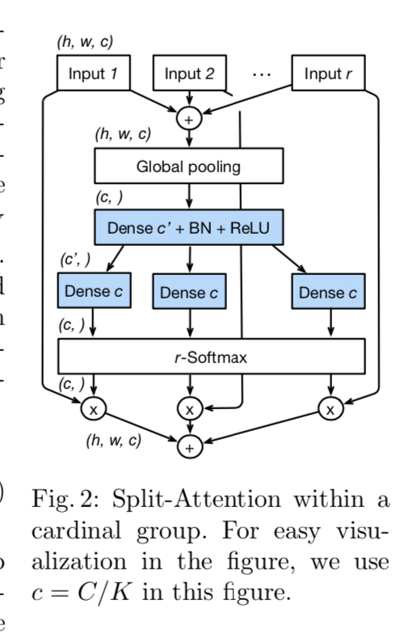

# ResNeSt: Split-Attention Networks

## Contributions 

- propose a resnet based network, ResNeSt, that outperforms other newtork iwth similar model complexities. e.g. ResNeSt-50 81.13% top-1 acc
- Incorporate feature map split attention within the individual netowrk blocks, split-attention block
- GREAT generalization ability in the most cv tasks, such as detection and segmentation 

## Key points

- Split-Attention Networks: enables feature-map attention across different feature-map groups 
  - **Freature-map Group**, the feature can be divided into several groups, the number of feature-map groups is given by a cardinality *K*. The resulting feature-map groups are *cardinal groups*. R indicates the number of splits within a cardinal group. The total number of feature groups is G = KR.
  - **Split Attention in Cardinal Groups** 
  - 
- Training 
  - Larg Mini-batch
  - Consine lr scheduler 
  - warm up lr from 0 to the initail value 
  - label smoothing for reducing the risk of overfitting 
  - auto augmentation, shift, roattion, color jittering 
  - Mixup Training (`TODO: HOW DOES THIS WORK`)
  - Large Crop size
  - Regularization, dropout=0.2, L2
  - use group normailization or synchronized batch normalization 
