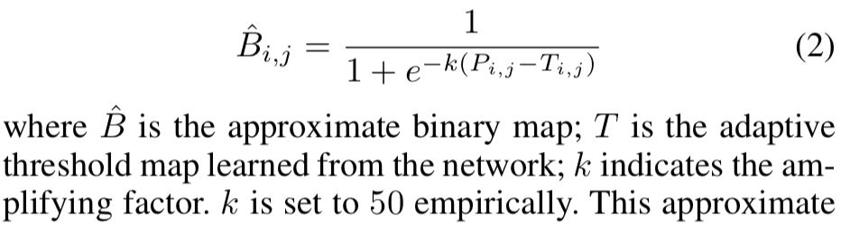
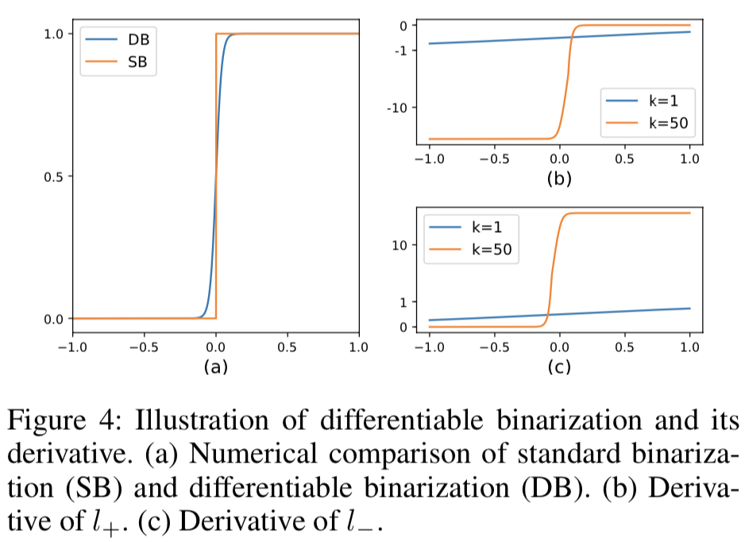

# Real-time Scene Text Detection with Differentiable Binarization

## Contributions

- Differentiable Binarization (DB) performs the binarization process in a segmentation network, optimized with a DB model for adaptively set the thresholds for binarization.
- DB module is differentiable & trainable, can be removed in the inference stage 

## key points

### Architecture
1. X is fed into a feature-pyramid backbone
2. Features are upsampled to the same scale and cascaded to produce feature F
3. F for predicting both probability map (P) and the threshold map (T)
4. the approximate binary map B is calculated by P and F
5. B, P and F are supervisied during training, P and B share the same supervision 
6. In inference, bounding boxes can be obtained from the B or P by a box formulation module 

### Differentiable binarization 

**awesome desgin**

> The differentiable binarization with adap-tive thresholds can not only help differentiate text regions from the background, but also separate text instances which are closely jointed.

