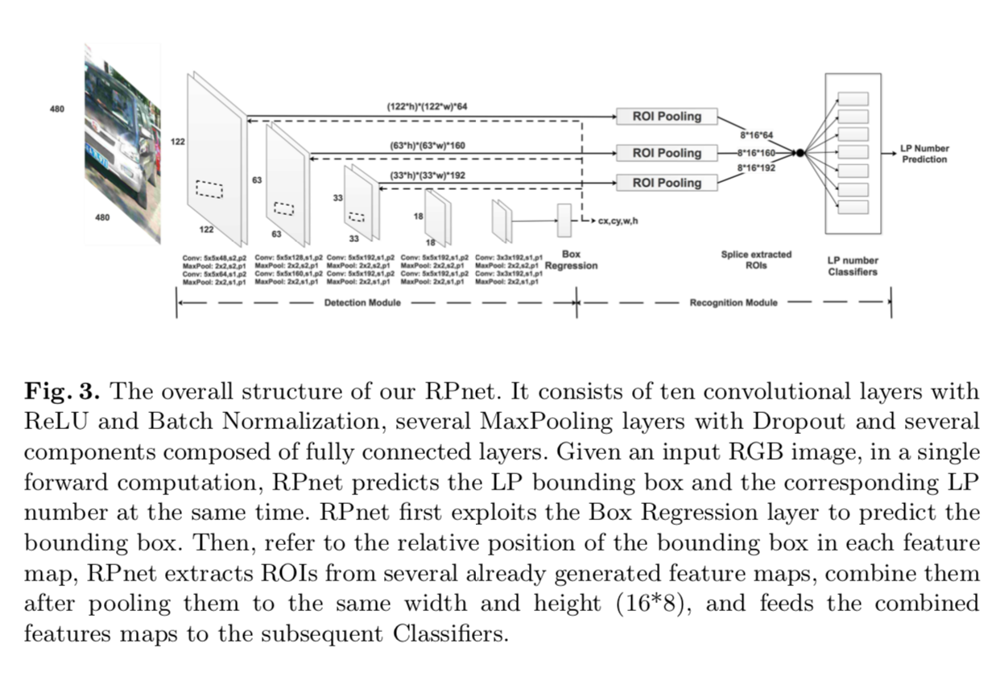

 
 # Towards End-to-End License Plate Detection and Recognition: A Large Dataset and Baseline

 ## Contributions
- introduce a large and comprehensive license plate dataset (CCPD), over 250k unique car images 
- a novel end2end network for dectection and recognition, Roadside Parking net (RPnet)
 
 ## key Points

- dataset annotations: 1) LP number 2) Lpp bounding box 3) four vertices locations 4) horizontal tilt degree and vertical tilt degree 5) Lp area, degree of brightness, the degree of vagueness 

