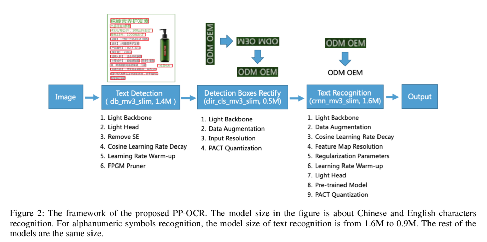
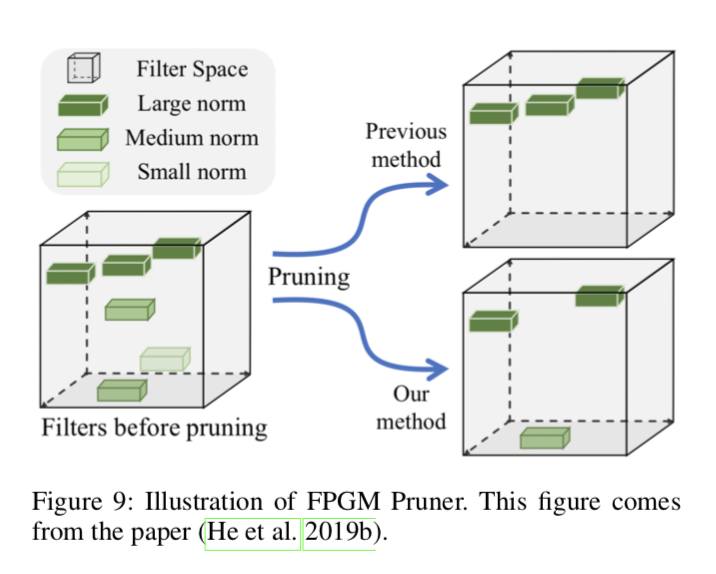
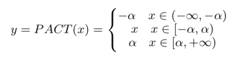

# PP-OCR: A Practical Ultra Lightweight OCR System

## Contributions 
- A practical ultra ligthweight OCR system, PP-OCR, consisting of three parts, text dection, detected boxes rectification and text recognition. (Model size 2.8MB ~ 3.5MB)

## Key Points

- Text Detection 
  - light Backbone: MobileNetV3, reduce model size and improve accuracy
  - Light Head: FPN,  reuduce model size
  - Remove SE in MobileNetV3: reduce model size
  - Cosine Learning Rate Decay: improve accuracy and fasten convergence 
  - Learning Rate Warm-up: stablize training process 
  - FPGM Prinner: reduce model size *Pruning every layer uniformly usually leads to significant performance degradation.* (`#TODO How?`)
  

- Direction Classification
  - Light Backbone: MobileNetV3, smaller than the bacbone of text detection
  - Data Augmentation: RandAgument + Base Data Augmentation 
  - Input Resolution: increase the resolution, improve the accuracy of the direction classification
  - PACT quantization: lower latency, smaller volume and lower cost, use online quantization that removes some outliers from the acitivations in advance. *modified version*.

- Text Recognition 
  - Light Backbone 
  - Data Augmentation: BDA + TIA
  - Cosine Learning Rate Decay
  - Feature Map Resolution, decrease stride to keep more info
  - Regularization Parameters: + L2
  - Learning Rate Warm-up 
  - Light Head
  - Pre-trained Model 
  - PACT Quantization

