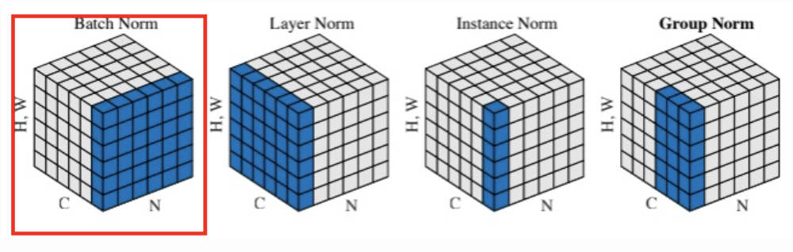
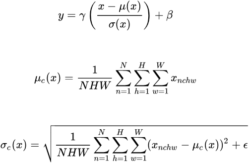
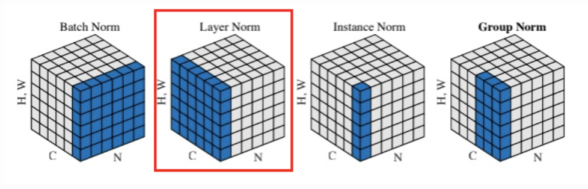
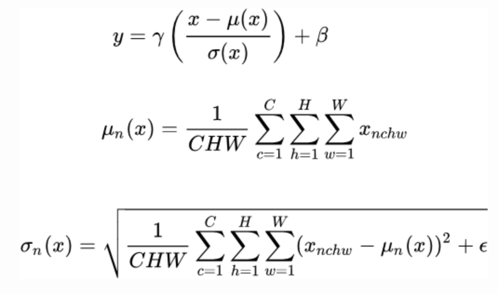
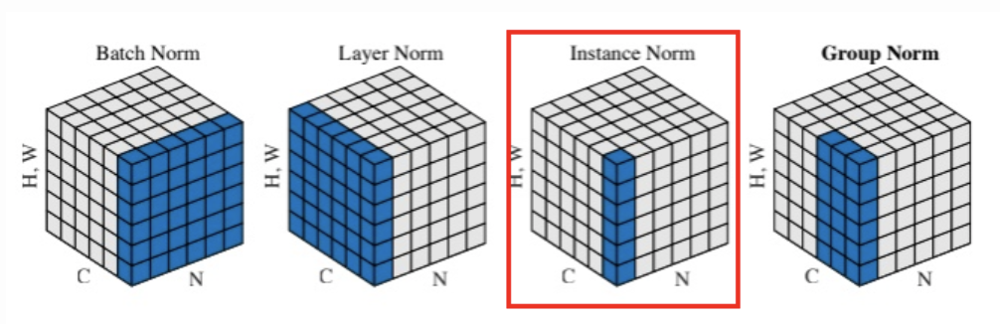
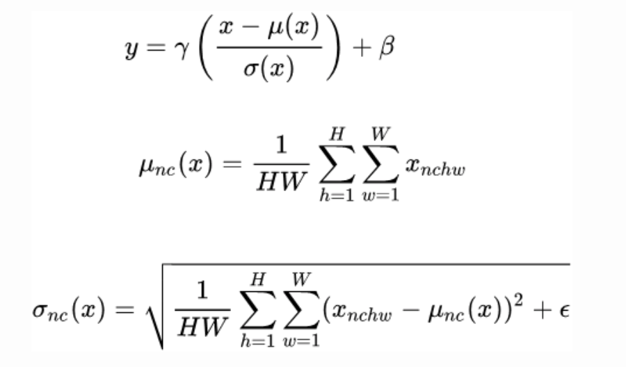
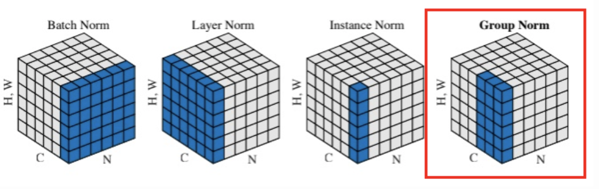
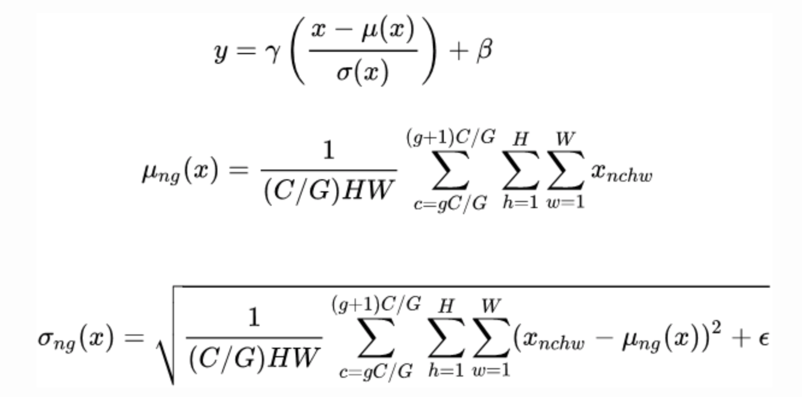

# Normalization 

## Batch Normalization 

- work well with large batch size mini-batch (>32 conventionally)
- need large memory 
- hardly implemented in RNN
  




```python
import torch
import torch.nn as nn

N,C,H,W = 4,3,5,5
x = torch.rand(N,C,H,W) * 1000 # feature map 

# implementation 
x_ = x.permute(1, 0, 2, 3).contiguous().view(3, -1)
mu = x_.mean(dim=1).view(1, 3, 1, 1)
std = x_.std(dim=1, unbiased=False).view(1, 3, 1, 1)
bn = (x - mu) / std

# official implementation, no afftine(gamma and beta)
bn = nn.BatchNorm2d(num_features=C, eps=0, affine=False, track_running_stats=False)
official_bn = bn(x)

# difference is close to zero
diff = (official_bn - bn).sum()
```

## Synchronized Batch Normalization 

Synchronized batch normalization is used when training a model across multiple GPUs. Bascially, it is batch normalization. It needs to calculate a average "mean" and "varaince" across different GPUs.

## Layer Normalization 

- No need batch




```python
import torch 
import torch.nn as nn

N,C,H,W = 4,3,5,5
x = torch.rand(N,C,H,W) * 1000 # feature map 

# implementation 
x_ = x.view(N,-1)
mu = x_.mean(dim=1).view(N,1,1,1)
std = x_.std(dim=1,unbiased=False).view(N,1,1,1)
my_ln = (x - mu) / std

# official implementation 
ln = nn.LayerNorm(normalized_shape=(C,H,W), eps=0,elementwise_affine=False)
official_ln = ln(x)

# difference is close to zero
diff = (official_ln - my_ln).sum()
```

## Instance Normalization 

- widely used in style transfering 




```python
import torch 
import torch.nn as nn

N,C,H,W = 4,3,5,5
x = torch.rand(N,C,H,W) * 1000 # feature map 

# implementation 
x_ = x.view(N*C,-1)
mu = x_.mean(dim=1).view(N,C,1,1)
std = x_.std(dim=1,unbiased=False).view(N,C,1,1)
my_in = (x - mu) / std

# official implementation 
ins_n = nn.InstanceNorm2d(num_features=C, eps=0,affine=False)
official_in = ins_n(x)

# difference is close to zero
diff = (official_in - my_in).sum()
```

## Group Nomalization

- Layer Normalization and Instance Normalization are two extreme cases of group normalization. 
- robust performance 




```python
import torch 
import torch.nn as nn

N,C,H,W = 4,16,5,5
G = 4
x = torch.rand(N,C,H,W) * 1000 # feature map 

# implementation 
x_ = x.view(N,G,-1)
mu = x_.mean(dim=-1).view(N,G,-1)
std = x_.std(dim=-1,unbiased=False).view(N,G,-1)
my_gn = (x_ - mu) / std
my_gn = my_gn.view(N,C,H,W)

# official implementation 
gn = nn.GroupNorm(num_groups=G, num_channels=C, eps=0, affine=False)
official_gn = gn(x)

# difference is close to zero
diff = (official_gn - my_gn).sum()
```